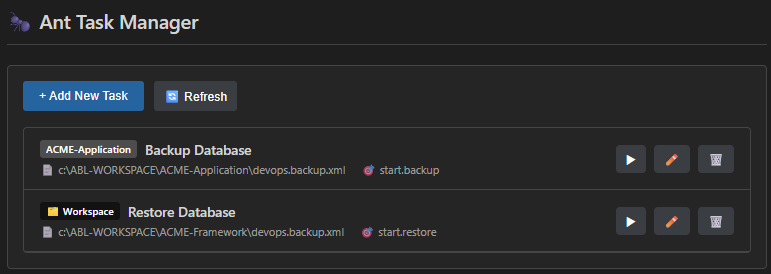
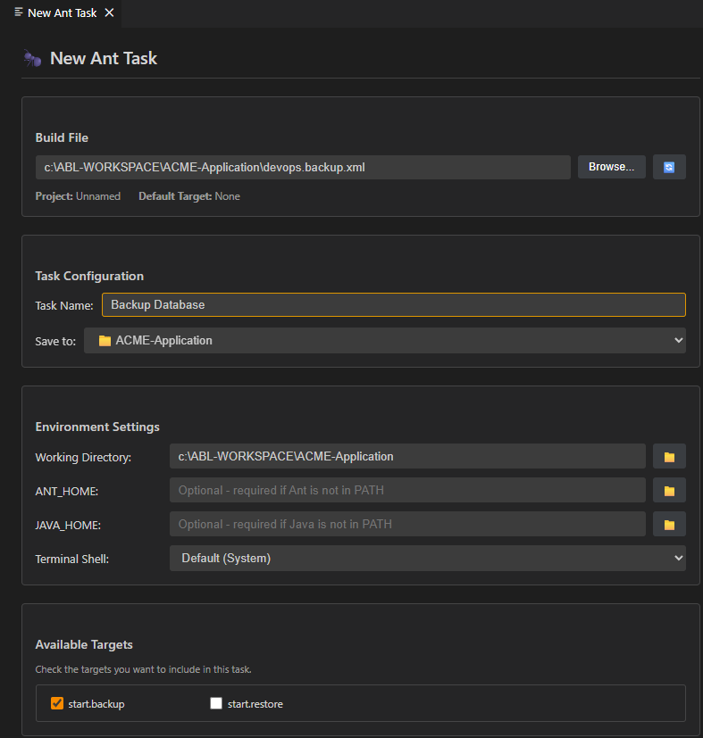
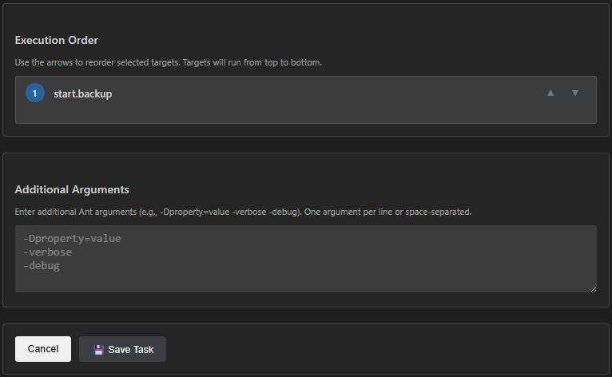
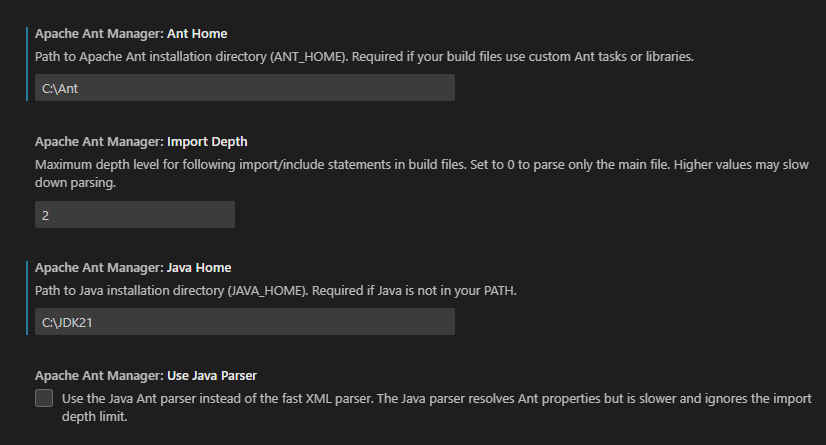

# Apache Ant Manager

[](https://marketplace.visualstudio.com/items?itemName=diabolo-68.apache-ant-manager)
[](https://opensource.org/licenses/MIT)

A Visual Studio Code extension that provides a graphical UI for configuring Apache Ant build tasks, similar to Eclipse's Ant launcher configuration.

## Features

-  **Visual Configuration UI** - Configure Ant tasks using a modern webview interface
-  **Build File Selection** - Browse and select Ant build.xml files
-  **Target Discovery** - Automatically parse and display available targets with descriptions
-  **Execution Order** - Define the order in which targets should be executed with drag-and-drop reordering
-  **Task Generation** - Generate VS Code tasks.json entries for your Ant configurations
-  **Tree View** - Browse Ant targets directly in the Explorer sidebar
-  **Environment Settings** - Configure working directory, ANT_HOME, JAVA_HOME, and shell
-  **Multi-Root Workspace Support** - Manage tasks across multiple workspace folders
-  **Workspace-Level Tasks** - Save tasks to the workspace file for shared configurations

## Screenshots

### Task Manager View


### Task Configuration



### Extension Settings


## Installation

### From VS Code Marketplace

1. Open VS Code
2. Go to Extensions (Ctrl+Shift+X)
3. Search for "Apache Ant Manager"
4. Click **Install**

### From Source

```bash
git clone https://github.com/diabolo-68/apache-ant-manager.git
cd apache-ant-manager
npm install
npm run compile
```

Then press F5 in VS Code to launch the extension in debug mode.

## Usage

### Opening the Configuration UI

1. **From Command Palette**: Press `Ctrl+Shift+P` (or `Cmd+Shift+P` on macOS) and run "Ant: Open Ant Configuration"
2. **From Explorer**: Right-click on a `build.xml` file and select "Open Ant Configuration"
3. **From Tree View**: Use the Ant Targets view in the Explorer sidebar

### Configuring a Build Task

1. Select your `build.xml` file using the Browse button
2. Enter a name for your task
3. Choose where to save the task (workspace folder or shared workspace file)
4. Configure environment settings (working directory, ANT_HOME, JAVA_HOME, shell)
5. Check the targets you want to run from the Available Targets grid
6. Use the ▲/▼ buttons to arrange execution order in the Execution Order list
7. Add any additional Ant arguments (e.g., `-Dproperty=value`, `-verbose`)
8. Click **Save Task** to create a VS Code task

### Managing Tasks

- **View Tasks**: Use the "Ant: View Ant Tasks" command to see all configured tasks
- **Run Tasks**: Click the ▶ button next to a task, or use VS Code's built-in "Run Task" command
- **Edit Tasks**: Click the ✏️ button to modify an existing task
- **Delete Tasks**: Click the 🗑️ button to remove a task

### Multi-Root Workspace Support

When working with multi-root workspaces:
- Each task shows a badge indicating which folder it belongs to
- You can save tasks to any workspace folder or to the shared workspace file
- Moving tasks between folders is supported when editing

## Requirements

- **Visual Studio Code** 1.85.0 or higher
- **Apache Ant** - Should be installed and accessible via PATH, or configured via ANT_HOME setting

### Optional

- **Java Runtime Environment (JRE) 11+** - Required only if using the Java parser option for advanced Ant property resolution

## Extension Settings

This extension contributes the following settings:

| Setting | Default | Description |
|---------|---------|-------------|
| `apacheAntManager.antHome` | `""` | Path to Apache Ant installation directory (ANT_HOME). Required if your build files use custom Ant tasks or libraries. |
| `apacheAntManager.javaHome` | `""` | Path to Java installation directory (JAVA_HOME). Required if Java is not in your PATH. |
| `apacheAntManager.importDepth` | `2` | Maximum depth level for following import/include statements in build files. Set to 0 to parse only the main file. |
| `apacheAntManager.useJavaParser` | `false` | Use the Java Ant parser instead of the fast XML parser. The Java parser resolves Ant properties but is slower. |

## Commands

| Command | Description |
|---------|-------------|
| `Ant: Open Ant Configuration` | Open the Ant task configuration panel |
| `Ant: Select Ant Build File` | Browse and select an Ant build file |
| `Ant: View Ant Tasks` | View and manage configured Ant tasks |
| `Ant: Run Ant Targets` | Run selected Ant targets |
| `Ant: Refresh` | Refresh the Ant targets tree view |

## Building from Source

### Prerequisites

- Node.js 18+
- npm

### Optional (for Java parser)

- Java JDK 11+
- Maven 3.6+

### Build Steps

```bash
# Install dependencies
npm install

# Compile TypeScript
npm run compile

# (Optional) Build Java parser component
cd java
mvn package
cd ..

# Run in debug mode - Press F5 in VS Code
```

### Project Structure

```
apache-ant-manager/
├── src/                    # TypeScript extension source
│   ├── extension.ts        # Extension entry point
│   ├── panels/             # Webview panels
│   ├── providers/          # Tree view providers
│   ├── services/           # Business logic services
│   └── types/              # TypeScript type definitions
├── java/                   # Java Ant parser component (optional)
│   ├── pom.xml
│   └── src/main/java/
├── media/                  # Webview CSS and assets
└── .vscode/                # VS Code configuration
```

## Known Issues

- The Java parser option requires Java 11+ and may be slower for large build files with many imports
- Target descriptions are only shown if defined in the build file's `description` attribute

## Contributing

Contributions are welcome! Please feel free to submit a Pull Request.

1. Fork the repository
2. Create your feature branch (`git checkout -b feature/AmazingFeature`)
3. Commit your changes (`git commit -m 'Add some AmazingFeature'`)
4. Push to the branch (`git push origin feature/AmazingFeature`)
5. Open a Pull Request

## Repository

- **GitHub**: [https://github.com/diabolo-68/apache-ant-manager](https://github.com/diabolo-68/apache-ant-manager)
- **Issues**: [https://github.com/diabolo-68/apache-ant-manager/issues](https://github.com/diabolo-68/apache-ant-manager/issues)

## License

This project is licensed under the MIT License - see the [LICENSE](LICENSE) file for details.

## Acknowledgments

- Inspired by Eclipse's Ant Build configuration dialog
- Uses the [Apache Ant](https://ant.apache.org/) build tool
- Built with the [VS Code Extension API](https://code.visualstudio.com/api)

---

**Enjoy building with Ant! 🐜**
